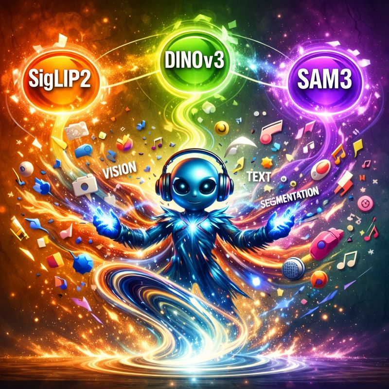

[](https://github.com/NVlabs/RADIO/stargazers)
[](LICENSE)
[](https://arxiv.org/abs/2601.17237)
[](https://openreview.net/pdf?id=lioemOcq3H)
[](https://arxiv.org/abs/2412.07679)
[](https://openaccess.thecvf.com/content/CVPR2025/papers/Heinrich_RADIOv2.5_Improved_Baselines_for_Agglomerative_Vision_Foundation_Models_CVPR_2025_paper.pdf)
[](https://arxiv.org/abs/2412.07679)
[](https://arxiv.org/abs/2410.01680)
[](https://arxiv.org/abs/2312.06709)
[](https://openaccess.thecvf.com/content/CVPR2024/papers/Ranzinger_AM-RADIO_Agglomerative_Vision_Foundation_Model_Reduce_All_Domains_Into_One_CVPR_2024_paper.pdf)

# \[CVPR 2024, 2025\] AM-RADIO: Agglomerative Vision Foundation Model - Reduce All Domains Into One

<!-- <div align="left"> -->

<!-- </div> -->

Official PyTorch implementation of \[CVPR 2025\] [**RADIOv2.5: Improved Baselines for Agglomerative Vision Foundation Models**](https://arxiv.org/abs/2412.07679)

Official PyTorch implementation of \[CVPR 2024\] [**AM-RADIO: Agglomerative Vision Foundation Model - Reduce All Domains Into One**](https://arxiv.org/abs/2312.06709)


Check out our preprints: [**PHI-S: Distribution Balancing for Label-Free Multi-Teacher Distillation**](https://arxiv.org/abs/2410.01680) and [**FeatSharp: Your Vision Model Features, Sharper**](https://www.arxiv.org/abs/2502.16025).


Mike Ranzinger, Greg Heinrich, [Jan Kautz](https://jankautz.com/), [Pavlo Molchanov](https://www.pmolchanov.com/).

[NVIDIA Research](https://www.nvidia.com/en-us/research/)

For business inquiries, please visit our website and submit the form: [NVIDIA Research Licensing](https://www.nvidia.com/en-us/research/inquiries/)

\[[C-RADIOv4 Tech Report](https://arxiv.org/abs/2601.17237)\]

\[[RADIOv2.5](https://arxiv.org/abs/2412.07679)\]\[[FeatSharp](https://www.arxiv.org/abs/2502.16025)\]\[[PHI-S](https://arxiv.org/abs/2410.01680)\]\[[AM-RADIO](https://arxiv.org/abs/2312.06709)\]\[[BibTex](#citing-radio)\]

<br clear="left"/>

## Latest Models

C-RADIOv4 Model Family ([Commercially Permissive](https://developer.download.nvidia.com/licenses/nvidia-open-model-license-agreement-june-2024.pdf))

We've updated our teacher set to \[SigLIP2-g-384, DINOv3-7B, SAM3\], along with some other things, and the result is our strongest set of models to date. See our [tech report](https://arxiv.org/abs/2601.17237) for more details.

Loadable via torchhub (e.g. `model_version='c-radio_v4-h'` or `model_version='c-radio_v4-so400m'`) or from HuggingFace:
- [C-RADIOv4-SO400M](https://huggingface.co/nvidia/C-RADIOv4-SO400M)
- [C-RADIOv4-H](https://huggingface.co/nvidia/C-RADIOv4-H)

```Python
from PIL import Image

import torch
from torch.nn import functional as F
from torchvision.transforms.functional import pil_to_tensor
model_version="c-radio_v4-h" # for C-RADIOv3-H model (ViT-H/16)
# NOTE: `force_reload` will re-download the source code too. If you have used our TorchHub in the past, we strongly recommend
# running with this flag once to pull the latest code.
model = torch.hub.load('NVlabs/RADIO', 'radio_model', version=model_version, progress=True, skip_validation=True, force_reload=True)
model.cuda().eval()

x = Image.open('assets/cradio_v4.png').convert('RGB')
x = pil_to_tensor(x).to(dtype=torch.float32, device='cuda')
x.div_(255.0)  # RADIO expects the input values to be between 0 and 1
x = x.unsqueeze(0) # Add a batch dimension

#### Example 1 ####
# Regular Usage
###################
nearest_res = model.get_nearest_supported_resolution(*x.shape[-2:])
x = F.interpolate(x, nearest_res, mode='bilinear', align_corners=False)

# RADIO expects the input to have values between [0, 1]. It will automatically normalize them to have mean 0 std 1.
summary, spatial_features = model(x)

#### Example 2 ####
# Returning features in NCHW format, for easier spatial handling
###################

# By default, RADIO will return the spatial_features in NLC format, with L being a combined height/width dimension.
# You can alternatively ask for the features in the more computer-vision-convenient format NCHW the following way:
summary, spatial_features = model(x, feature_fmt='NCHW')
assert spatial_features.ndim == 4

#### Example 3 ####
# AMP autocasting (mixed precision, critical for fast performance with self attention)
###################

# RADIO also supports running in mixed precision:
with torch.autocast('cuda', dtype=torch.bfloat16):
    summary, spatial_features = model(x)

#### Example 4 ####
# Decoupled input normalization
###################

# If you'd rather pre-normalize the inputs, then you can do this:
conditioner = model.make_preprocessor_external()

# Now, the model won't change the inputs, and it's up to the user to call `cond_x = conditioner(x)` before
# calling `model(cond_x)`. You most likely would do this if you want to move the conditioning into your
# existing data processing pipeline.
with torch.autocast('cuda', dtype=torch.bfloat16):
    cond_x = conditioner(x)
    summary, spatial_features = model(cond_x)

#### Example 5 ####
# Teacher adaptors, e.g. for text alignment
###################

# Adaptors
# One or more may be specified via the `adaptor_names` argument
model = torch.hub.load('NVlabs/RADIO', 'radio_model', version=model_version, progress=True, skip_validation=True, adaptor_names=['siglip2-g'])
model.cuda().eval()

vis_output = model(x)
# These are the usual RADIO features
backbone_summary, backbone_features = vis_output['backbone']
# There will also be summary and feature pairs for each of the loaded adaptors
sig2_vis_summary, sig2_vis_features = vis_output['siglip2-g']

# The 'siglip2-g' and 'clip' adaptors (when available) are special because they also support text tokenization and encoding
sig2_adaptor = model.adaptors['siglip2-g']
text_input = sig2_adaptor.tokenizer(['An image of an alien wearing headphones, with three orbs floating overhead']).to('cuda')
text_tokens = sig2_adaptor.encode_text(text_input, normalize=True)

sim = F.cosine_similarity(sig2_vis_summary, text_tokens)
print(sim)
```

We also demonstrate how to use C-RADIOv4 to replace the vision encoder in SAM3 here: https://github.com/mranzinger/sam3-radio/blob/main/demo_sam3_radio.py

## Older Models

C-RADIOv3 Model Family ([Commercially Permissive](https://developer.download.nvidia.com/licenses/nvidia-open-model-license-agreement-june-2024.pdf))

Loadable via torchhub (e.g. `model_version='c-radio_v3-h'`) or from HuggingFace:
- [C-RADIOv3-B](https://huggingface.co/nvidia/C-RADIOv3-B)
- [C-RADIOv3-L](https://huggingface.co/nvidia/C-RADIOv3-L)
- [C-RADIOv3-H](https://huggingface.co/nvidia/C-RADIOv3-H)
- [C-RADIOv3-g](https://huggingface.co/nvidia/C-RADIOv3-g)

Now, also supported as a [Foundation Model in TAO Toolkit](https://docs.nvidia.com/tao/tao-toolkit/text/foundation_models/overview.html)!

---


## News/Release

- [1.29.2026] RADSeg code was open sourced. [Code](https://github.com/RADSeg-OVSS/RADSeg) [Paper](https://arxiv.org/abs/2511.19704)
- [1.27.2026] C-RADIOv4 has been released.
    - Load via TorchHub or
    - HuggingFace: [C-RADIOv4-SO400M](https://huggingface.co/nvidia/C-RADIOv4-SO400M) [C-RADIOv4-H](https://huggingface.co/nvidia/C-RADIOv4-H)
- [11.26.2025] [RADSeg](https://arxiv.org/abs/2511.19704): Shout out to Alama, Jariwala, Bhattacharya et al. who have pushed RADIO even further in the domain of Open Vocabulary Semantic Segmentation in both the 2D and 3D domains. They've strongly set the SOTA, both in raw metrics, and especially on pareto, running significantly faster than nearby competitors.
- [6.25.2025] [FeatSharp](https://github.com/NVlabs/FeatSharp) code is now available! We used this to train all of the C-RADIOv3 models, and also the C-RADIOv2-VLM model that's powering Llama Nemotron Nano VL 8B, currently \#1 on [OCR Bench v2](https://ling99-ocrbench-v2-leaderboard.hf.space/).
- [6.3.2025] 🔥🔥🔥 C-RADIOv3 has been released. These are [commercially viable models](https://developer.download.nvidia.com/licenses/nvidia-open-model-license-agreement-june-2024.pdf), and also represent our strongest models to date!
  - Can be loaded using TorchHub, or:
  - Huggingface: [C-RADIOv3-B](https://huggingface.co/nvidia/C-RADIOv3-B) [C-RADIOv3-L](https://huggingface.co/nvidia/C-RADIOv3-L) [C-RADIOv3-H](https://huggingface.co/nvidia/C-RADIOv3-H) [C-RADIOv3-g](https://huggingface.co/nvidia/C-RADIOv3-g)
- [5.1.2025] FeatSharp has been accepted to **ICML 2025**.
- [2.26.2025] RADIOv2.5 paper has been accepted to **CVPR 2025**. See you in Nashville.
- [12.18.2024] We release C-RADIO, a ViT-H/16 model which can be used for commercial products, under the [NVIDIA Open Model License Agreement](https://developer.download.nvidia.com/licenses/nvidia-open-model-license-agreement-june-2024.pdf) license!
- [12.11.2024] We release RADIOv2.5 ViT-g/14, our biggest model yet!
- [12.10.2024] We release \[[RADIO-Amplified](https://arxiv.org/abs/2412.07679)\] to ArXiv with details on our method to address the mode-switching issue (previously described in this [tech report](./RADIOv2.5_tech_report.md)) and our efficient VLM integration method.
- [10.2.2024] 🔥🔥 RADIOv2.5 ViT-H/16 model is released. We have also released \[[PHI-S: Distribution Balancing for Label-Free Multi-Teacher Distillation](https://arxiv.org/abs/2410.01680)\] to ArXiv that details one of the major algorithm updates behind the version 2.5 releases.
- [7.22.2024] 🔥 RADIOv2.5 ViT-B/16 and ViT-L/16 are released. For VLLM tasks, RADIOv2.5-B is as good or better than RADIOv2, and RADIOv2.5-L is much better! See [tech report](./RADIOv2.5_tech_report.md).
- [4.30.2024] 🔥 README is updated with more metrics, Arxiv is updated with new results.
- [3.21.2024] 🔥 RADIOv2.1 is released. Trained in bf16, improves metrics!
- [2.26.2024]  AM-RADIO paper has been accepted to **CVPR 2024**
- [2.15.2024]  RADIOv2 is released. Trained with DFN CLIP; OpenAI CLIP; DINOv2; SAM teachers. Note that SAM teacher was not used in previous models.
- [1.5.2024] Initial github repo is released.

---

## Abstract


AM-RADIO is a framework to distill Large Vision Foundation models into a single one.
RADIO, a new vision foundation model, excels across visual domains, serving as a superior replacement for vision backbones. Integrating CLIP variants, DINOv2, and SAM through distillation, it preserves unique features like text grounding and segmentation correspondence. Outperforming teachers in ImageNet zero-shot (+6.8%), kNN (+2.39%), and linear probing segmentation (+3.8%) and vision-language models (LLaVa 1.5 up to 1.5%), it scales to any resolution, supports non-square images. We offer an efficient variant, E-RADIO, which achieves is 6-10x faster than CLIP and DINOv2.

<div align="left">
  
</div>

## Licensing

Models prefixed with `C-RADIO` are governed by the [NVIDIA Open Model License](https://developer.download.nvidia.com/licenses/nvidia-open-model-license-agreement-june-2024.pdf), which enables commercial use cases.

Models prefixed with `E-RADIO` and `RADIO` are governed by the [NSCL LICENSE](./LICENSE) file, which is non-commercial.

## Quick start and model versions:

The latest model version is C-RADIOv3. We will update the description once new model is available.

### Finding Supported Versions

The list of available versions, and some of their attributes, can be found in [common.py](./radio/common.py). Those keys in the `RESOURCE_MAP` dictionary may be used as the `version` argument in `torch.hub.load`. Refer to the licensing section above for the use restrictions of particular models.

### C-RADIO

The C-RADIO (stands for Commercial RADIO) family of models are trained using different data that is commercially viable. Because of this, it enables us to release with the [NVIDIA Open Model License](https://developer.download.nvidia.com/licenses/nvidia-open-model-license-agreement-june-2024.pdf) which allows for commercial use cases.

Along with the TorchHub usage above, we also support HuggingFace

<details>
<summary> HuggingFace </summary>
### HuggingFace (HF)

```Python
import torch
from PIL import Image
from transformers import AutoModel, CLIPImageProcessor

# hf_repo = "nvidia/E-RADIO" # For E-RADIO.
#hf_repo = "nvidia/RADIO-B" # For RADIO-B.
hf_repo = "nvidia/C-RADIOv4-H" # For RADIO-H.
#hf_repo = "nvidia/RADIO-g" # For RADIO-g.
#hf_repo = "nvidia/C-RADIO" # For C-RADIO-H.
#hf_repo = "nvidia/RADIO-L" # For RADIO-L.

image_processor = CLIPImageProcessor.from_pretrained(hf_repo)
model = AutoModel.from_pretrained(hf_repo, trust_remote_code=True)
model.eval().cuda()

image = Image.open('./assets/radio.png').convert('RGB')
pixel_values = image_processor(images=image, return_tensors='pt', do_resize=True).pixel_values
pixel_values = pixel_values.cuda()

summary, features = model(pixel_values)
```

</details>


### HuggingFace

```python
from PIL import Image
from transformers import AutoModel, CLIPImageProcessor

hf_repo = "nvidia/C-RADIOv4-H" # For RADIO.
# hf_repo = "nvidia/E-RADIO" # For E-RADIO.

image_processor = CLIPImageProcessor.from_pretrained(hf_repo)
model = AutoModel.from_pretrained(hf_repo, trust_remote_code=True)
model.eval().cuda()

image = Image.open('./examples/image1.png').convert('RGB')
pixel_values = image_processor(images=image, return_tensors='pt').pixel_values
pixel_values = pixel_values.to(torch.bfloat16).cuda()

summary, features = model(pixel_values)
```

In order to use adaptors with models from HuggingFace, first you need to load the config
and set `adaptor_names`, then load the model using this config.

```python
config = AutoConfig.from_pretrained(args.hf_repo, trust_remote_code=True)
config.adaptor_names = ["clip", "sam"]
model = AutoModel.from_pretrained(hf_repo, trust_remote_code=True, config=config)
model.eval().cuda()

clip_summary, clip_features = model(pixel_values)["clip"].summary, model(pixel_values)["clip"].features
sam_summary, sam_features = model(pixel_values)["sam"].summary, model(pixel_values)["sam"].features
```

### Extra Attributes

We have trained this model to be flexible in input dimension. It supports arbitrary input sizes. There are useful properties set for the returned model that you may query:
```Python
model.patch_size: int
model.max_resolution: int # (Images can be no larger than this value on either dimension)
model.preferred_resolution: Tuple[height, width] # This is the primary resolution that RADIO was trained at, and will likely
                                                 # produce best results for summary tasks. Dense tasks require experimentation
                                                 # to find the best resolution.
model.window_size: Optional[int] # If `vitdet_window_size` was specified, this is that value
model.min_resolution_step: int # Combines `patch_size` and `window_size` to define what each image dimension must be a multiple of.
                               # e.g. If `patch_size == 16`, then both width and height must be x*16
                               # If `patch_size == 14` and `window_size == 8` then width and height must be x*14*8

# For convenience, you can also call this function to get the nearest valid input size for a given image
nearest_height, nearest_width = model.get_nearest_supported_resolution(height=1024, width=1024)
```

RADIO allows non-square inputs. In fact, RADIO achieves higher zero-shot classification scores when allowing the larger image dimension to vary, and only fixing the smaller dimension.

#### Supported Adaptors:

- RADIOv2.5: `clip`, `siglip`, `dino_v2`, `sam`
- RADIOv2\[.1\]: `clip`, `dino_v2`, `sam`
- C-RADIOv3: `clip`, `siglip2-g`, `dino_v2`, `sam`
- C-RADIOv4: `siglip2-g`, `dino_v3`, `sam3`

The `clip` and `siglip` adaptors have the additional functionality of supporting tokenization and language encoding. Refer to `examples/zero_shot_imagenet.py` for this use, as well as the [API](https://github.com/NVlabs/RADIO/blob/main/radio/open_clip_adaptor.py#L33-L36).

### Preprocessing

By default, RADIO expects the input images to have normalized values in the `[0, 1]` range. If you already have an existing data pipeline, and you'd like conditioning to occur there instead of within the RADIO model, you can call this function:

```Python
preprocessor = model.make_preprocessor_external()

images = preprocessor(images)
...
output = model(images)
```

<details>
<summary>HuggingFace hub</summary>

All our HuggingFace models are available under the umbrella of the [Nvidia RADIO collection](https://huggingface.co/collections/nvidia/radio-669f77f1dd6b153f007dd1c6).

</details>

### Intermediate Layer Activations
_(Currently only supported with RADIO)_

Intermediate layer activations can be fetched during inference by using the `forward_intermediates()` method.
Example:

```Python
outputs = model.forward_intermediates(images, indices=[7, 15, 23, 31])
```

## Training

_Coming Soon_

## Star History

<a href="https://star-history.com/#NVlabs/RADIO&Date">
 <picture>
   <source media="(prefers-color-scheme: dark)" srcset="https://api.star-history.com/svg?repos=NVlabs/RADIO&type=Date&theme=dark" />
   <source media="(prefers-color-scheme: light)" srcset="https://api.star-history.com/svg?repos=NVlabs/RADIO&type=Date" />
   
 </picture>
</a>

## Citing RADIO

If you find this repository useful, please consider giving a star and citation:

### RADIOv2.5: Improved Baselines for Agglomerative Vision Foundation Models

#### ArXiv Reference:

```bibtex
@misc{heinrich2025radiov25improvedbaselinesagglomerative,
      title={RADIOv2.5: Improved Baselines for Agglomerative Vision Foundation Models},
      author={Greg Heinrich and Mike Ranzinger and Hongxu and Yin and Yao Lu and Jan Kautz and Andrew Tao and Bryan Catanzaro and Pavlo Molchanov},
      year={2024},
      eprint={2412.07679},
      archivePrefix={arXiv},
      primaryClass={cs.CV},
      url={https://arxiv.org/abs/2412.07679},
}
```

### FeatSharp: Your Vision Model Features, Sharper

#### ICML 2025 Reference
```bibtex
@inproceedings{
ranzinger2025featsharp,
title={FeatSharp: Your Vision Model Features, Sharper},
author={Mike Ranzinger and Greg Heinrich and Pavlo Molchanov and Bryan Catanzaro and Andrew Tao},
booktitle={Forty-second International Conference on Machine Learning},
year={2025},
url={https://openreview.net/forum?id=lioemOcq3H}
}
```

#### ArXiv Reference:
```bibtex
@misc{ranzinger2025featsharpvisionmodelfeatures,
      title={FeatSharp: Your Vision Model Features, Sharper},
      author={Mike Ranzinger and Greg Heinrich and Pavlo Molchanov and Jan Kautz and Bryan Catanzaro and Andrew Tao},
      year={2025},
      eprint={2502.16025},
      archivePrefix={arXiv},
      primaryClass={cs.CV},
      url={https://arxiv.org/abs/2502.16025},
}
```

### PHI-S: Distribution Balancing for Label-Free Multi-Teacher Distillation

#### ArXiv Reference:
```bibtex
@misc{ranzinger2024phisdistributionbalancinglabelfree,
      title={PHI-S: Distribution Balancing for Label-Free Multi-Teacher Distillation},
      author={Mike Ranzinger and Jon Barker and Greg Heinrich and Pavlo Molchanov and Bryan Catanzaro and Andrew Tao},
      year={2024},
      eprint={2410.01680},
      archivePrefix={arXiv},
      primaryClass={cs.LG},
      url={https://arxiv.org/abs/2410.01680},
}
```

### AM-RADIO: Agglomerative Vision Foundation Model - Reduce All Domains Into One

#### CVPR 2024 Reference:
```bibtex
@InProceedings{Ranzinger_2024_CVPR,
    author    = {Ranzinger, Mike and Heinrich, Greg and Kautz, Jan and Molchanov, Pavlo},
    title     = {AM-RADIO: Agglomerative Vision Foundation Model Reduce All Domains Into One},
    booktitle = {Proceedings of the IEEE/CVF Conference on Computer Vision and Pattern Recognition (CVPR)},
    month     = {June},
    year      = {2024},
    pages     = {12490-12500}
}
```

#### ArXiv Reference:
```bibtex
@misc{ranzinger2023amradio,
      title={AM-RADIO: Agglomerative Model -- Reduce All Domains Into One},
      author={Mike Ranzinger and Greg Heinrich and Jan Kautz and Pavlo Molchanov},
      year={2023},
      eprint={2312.06709},
      archivePrefix={arXiv},
      primaryClass={cs.CV}
}
```

## Licenses

Copyright © 2024, NVIDIA Corporation. All rights reserved.

This work is made available under the NVIDIA Source Code License-NC. Click [here](LICENSE) to view a copy of this license.
